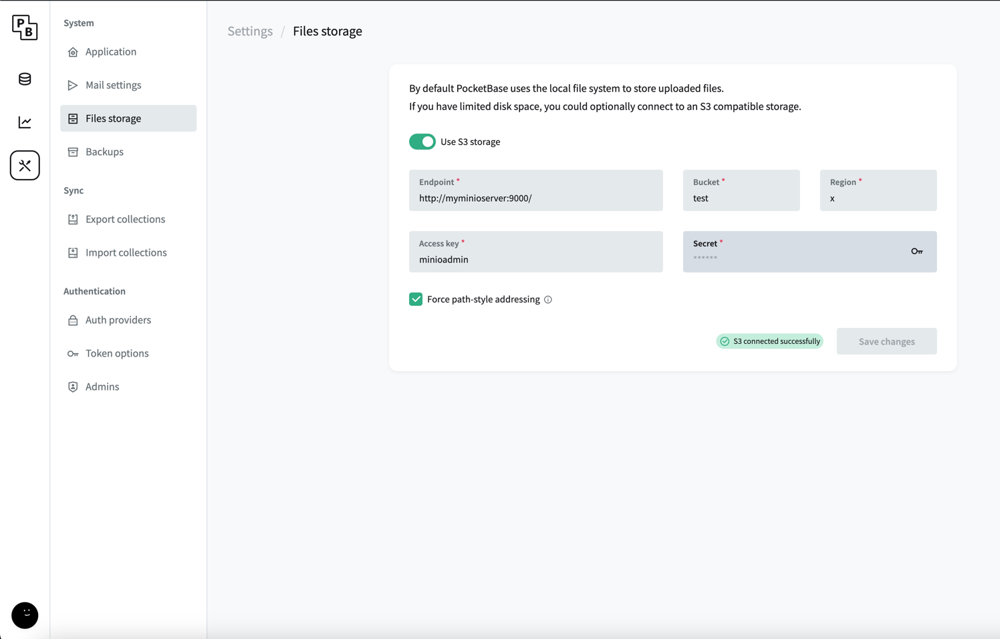

# Versioned-CV

## What is it
- web app to rapidly version resumes & cv's for job applications. Output is an HTML doc that can be hosted/shared that is mobile friendly and easy to keep up to date. Downloading the HTML into a PDF for bytes is trivial.
- It's a platform for a user to sign up, and create any number of versions of their resumes and coverletters. Choosing to either opt into default schemas for templating, or choosing to roll their own schema and templating preference. Basically, it's just an inbrowser editor for a JSON field and a templating field. It's live rendered injecting `tailwindcss` & `React` into the templating expression. So, any JSX is valid to save. The motivation is sometimes, when applying to multiple jobs you might want to tweak the resume (content or markup) ever so slightly. So this just versions all the edits to the resume values and the template used. Eventually, an `application` feature will be implemented where we could pull in a job listing/description and generate on the fly a more custom resume + templating for the job. Then we can easily track the application process from there. The current version is built very very loosely. The resume.content is just an free JSON, w/ no schemas, an the templating is anything JSX ( regardless of if the template is compliant w/ the resume.content shape ). The idea being, at the end of the day whatever this project might look like will end up being just JSON and templates, so it seemed sensible to just ship that - an in browser editor for the two. I joked to myself that I could write a self-owning blogpost about how dumb an idea it is to version and write code like this could be called "non-committal" - since these values would be much more suitably tracked in something like git. But I really just wanted to rapidly write up different versions and being able to pin/fork/point to if a partical JSON shape or templating strategy emerged... if we ever get to that point, we could better handle the data in w/ the knowledge of the future. So, maybe for a v1 I just make 15 different templates all  consuming the same resume json shape. Those 15 templates would generate a resume for anyone willing to translate their resume into my resume json shape. From there the user could just be happy w/ the template and move on, or they could change the resume values to be slightly different, or if they wanted to actually change the templating they could write custom JSX w/ tailwind to render the resume in exactly the way they want. That could be hidden behind an "advanced" feature and just shipping plain templates.  


## Admission 
- I don't think anyone should use this website. Clearly, there are other tools and workflows that solve this problem. On top of that, the architecture used is questionable at best. Manually storing JSX as text strings? Probably not a great idea, but the project was an excuse to "build something" with tools that I've read about but not intereacted with ( Pocketbase, SQLite, Litestream, NextJS and Server Components, Tailwindcss, minio, fly.io, etc etc etc )

#

## Built with
- pocketbase ( SQLite )
- Litestream for S3 replication & backups.
- NextJS w/ app directory, server actions, and server components.

## Local dev
- Running `make dev` should be enough
  ```bash
    make dev
 - this will initiate the docker compose up build pocketbase locally, add litestream to the docker container, spin up `minio` for local s3 replication, and handle any migrations that need to happen.
 - If it's your first time running, you'll need to configure the `file storage` in the pocketbase `admin` to point to the minio targets present in the Makefile/Dockerfile/docker-compose/litestream.yml


## Production
- Deploys happen to `fly.io` and so we need to set some secrets for the AWS access id and secret, s3 name. This is handled in the `Makefile`
- When secrets are set, images can be deployed to `fly.io` using `make deploy`.